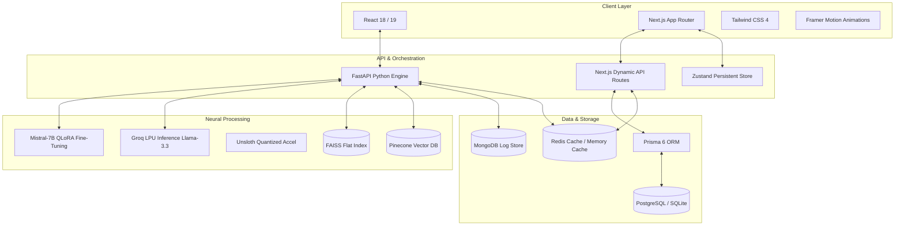

<!-- HEADER BANNER -->
<p align="center">
  
</p>

<!-- DYNAMIC TYPING COMPONENT -->
<p align="center">
  <a href="https://github.com/yakoob-md">
    
  </a>
</p>

<p align="center">
  <a href="https://linkedin.com/in/yakoob-md"></a>
  <a href="mailto:dabaalover@gmail.com"></a>
  <a href="https://github.com/yakoob-md?tab=repositories"></a>
</p>

---

## 🧠 Builder Philosophy

```rust
struct Engineer {
    name: String,
    core_values: Vec<String>,
    latency_budget: Duration,
}

impl Build for Engineer {
    fn think_and_execute(&self) {
        // 1. If it's slow, it's broken (sub-second or nothing).
        // 2. Percentages hide reality; always calculate absolute rupee leakage.
        // 3. Keep compilers at 0 errors. Strict types prevent runtime pain.
    }
}
```

---

## 🌌 The Project Universe

Categorized showcases of core technical achievements. Click on repository headers to deep dive into the codebases.

### 🧠 Generative AI, Fine-Tuning & Vector RAG

<table width="100%">
  <tr>
    <td width="50%" valign="top">
      <h3>🛡️ <a href="https://github.com/yakoob-md/v-shield-ai">V-Shield AI</a></h3>
      <p><b>Vernacular Anti-Doping Voice Assistant</b></p>
      <p>Voice-first multilingual RAG protecting Indian rural athletes from accidental doping using WADA data.</p>
      <p>
        <code>FastAPI</code> • <code>React</code> • <code>Whisper-v3</code> • <code>FAISS</code> • <code>Llama-3.3 70B</code> • <code>Groq LPU</code>
      </p>
      <ul>
        <li><b>Wow Factor:</b> Fluid midnight-glass layout running at hardware-accelerated 60FPS.</li>
        <li><b>Impact:</b> Audio queries in Hinglish answered under 800ms using LRU memory caching.</li>
      </ul>
    </td>
    <td width="50%" valign="top">
      <h3>📜 <a href="https://github.com/yakoob-md/Cuad_finetuned">CUAD Legal AI</a></h3>
      <p><b>Contract Clause Risk Analyzer & Auditor</b></p>
      <p>End-to-end Legal AI fine-tuning Mistral-7B using QLoRA PEFT coupled with semantic contract indexing.</p>
      <p>
        <code>Mistral-7B</code> • <code>QLoRA</code> • <code>Unsloth</code> • <code>FastAPI</code> • <code>React 18</code> • <code>MongoDB</code>
      </p>
      <ul>
        <li><b>Wow Factor:</b> Integrated PDF rendering and high-depth text highlighting of target risk segments.</li>
        <li><b>Impact:</b> Reduces corporate legal review times by auto-tagging clause overlaps.</li>
      </ul>
    </td>
  </tr>
  <tr>
    <td width="50%" valign="top">
      <h3>🎙️ <a href="https://github.com/yakoob-md/genAi_finetuned">Mistral Transcript Pipeline</a></h3>
      <p><b>Noisy Conversation Summarizer</b></p>
      <p>A memory-efficient fine-tuning NLP pipeline translating messy spoken dialogues into business intelligence summaries.</p>
      <p>
        <code>Mistral-7B</code> • <code>Quantization (NF4)</code> • <code>Double Quantization</code> • <code>PyTorch</code> • <code>Kaggle T4</code>
      </p>
      <ul>
        <li><b>Wow Factor:</b> Label masking safeguards preventing semantic overfitting.</li>
        <li><b>Impact:</b> Achieved a 15.68 ROUGE-L score, beating standard zero-shot baselines by 11.8%.</li>
      </ul>
    </td>
    <td width="50%" valign="top">
      <h3>🧠 <a href="https://github.com/yakoob-md/InteleX">InteleX</a></h3>
      <p><b>Multi-Source Semantic RAG Ecosystem</b></p>
      <p>Universal document and transcript ingestion engine providing semantically grounded answers.</p>
      <p>
        <code>FastAPI</code> • <code>Pinecone Serverless</code> • <code>Groq LLaMA-3.3</code> • <code>MySQL</code> • <code>Docker</code>
      </p>
      <ul>
        <li><b>Wow Factor:</b> Universal parsers for PDFs, dynamic live URLs, and YouTube transcripts.</li>
        <li><b>Impact:</b> Dual-pass semantic retrieval and cross-encoder reranking yields zero hallucinations.</li>
      </ul>
    </td>
  </tr>
</table>

### 📊 WealthTech, Analytics & Systems

<table width="100%">
  <tr>
    <td width="100%" valign="top">
      <h3>💸 <a href="https://github.com/yakoob-md/Vestora">Vestora</a></h3>
      <p><b>Mutual Fund Portfolio Intelligence Co-Pilot</b></p>
      <p>Indian retail portfolio leak analyzer. Exposes Regular Plan commission leakage by comparing Direct vs. Regular assets in real time.</p>
      <p>
        <code>Next.js 16 (App Router)</code> • <code>React 19</code> • <code>Tailwind CSS 4.0</code> • <code>Prisma 6</code> • <code>Zustand</code> • <code>Redis</code> • <code>PostgreSQL</code>
      </p>
      <ul>
        <li><b>Wow Factor:</b> Zero-lag real-time AMFI/MFAPI background sync with dynamic portfolio rebalancing engines.</li>
        <li><b>Impact:</b> Projects compounding lifetime cost leakages in rupees, helping investors salvage lakhs of wealth.</li>
        <li><b>Health:</b> 100% type safety and compiled with zero errors across frontend and backend layers.</li>
      </ul>
    </td>
  </tr>
</table>

---

## 🛠️ Visual Skill Map & Architectural Alignment

The diagram below shows how my core technical clusters communicate to form production RAGs and visual full-stack platforms:



---

## 📈 Learning Journey & Evolution

```
[ 2024: Foundational Systems ]
  └── Developed core web architectures & classic machine learning (Flask, Flask ML, Pandas).
  └── Focus: Relational database schemas, REST APIs, and basic UI design.
       │
[ 2025: Advanced Full-Stack & Caching ]
  └── Shifted to Next.js (App Router), Zustand, and Prisma ORM.
  └── Integrated Redis and memory-cached pipelines for sub-second database transactions.
  └── Focus: State persistence, database speed optimizations, and visual midnight-glass systems.
       │
[ 2026: Generative AI, Fine-Tuning & Quantization ]
  └── Fine-tuning large open-source LLMs (Mistral-7B) using QLoRA PEFT (Unsloth, bitsandbytes).
  └── Pioneered voice-first multilingual RAG engines with Whiskey STT and high-dimensional vector grids.
  └── Focus: Memory efficiency on Kaggle T4, context grounding, and semantic vector reranking.
```

---

## 🛡️ Engineering Principles

<p align="center">
  
  
  
  
</p>

- **Latency-First**: If a vector retrieval or caching layer takes more than 100ms, optimize the indexes or cache-key structures.
- **Fact-Grounded**: LLMs must be strictly anchored to a verifiable context (FAISS/Pinecone). If a prompt cannot find grounding evidence, report `UNKNOWN` deterministically rather than hallucinating.
- **Premium Aesthetics**: Code quality should be matched by visual quality. Micro-animations and high-contrast styling drive user trust in engineering systems.

---

## ⚡ Build Log & Current Explorations

- **📄 CAS PDF Parser**: Building an async parser for Indian Consolidated Account Statement (CAS) PDFs to auto-ingest mutual fund portfolios into **Vestora** using custom layout-aware text extractors.
- **🎙️ Edge-Native TTS**: Experimenting with edge-running, highly optimized text-to-speech engines in the browser to reduce latency in voice assistants like **V-Shield AI**.
- **⚡ PEFT Grounding Evaluation**: Quantifying hallucinations of our QLoRA fine-tuned models vs. base models using SelfCheckGPT framework scores.

---

## 🚪 Repository Discovery Zone

Ready to see how these architectures run under the hood? Explore the codebases directly:

<p align="center">
  <a href="https://github.com/yakoob-md/Vestora">
    
  </a>
  <a href="https://github.com/yakoob-md/InteleX">
    
  </a>
</p>

---

<p align="center">
  <sub>"Simplicity is the ultimate sophistication. Crafting elegant solutions one compile at a time."</sub><br/>
  <b>Built with ❤️ by Yakoob M.D.</b>
</p>
