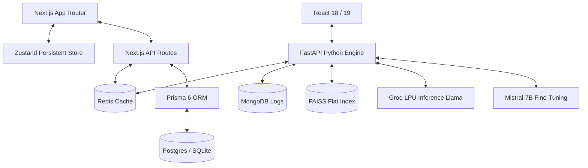

<!-- HEADER RENDERING -->
<p align="center">
  
</p>

<!-- DYNAMIC TYPING COMPONENT -->
<p align="center">
  <a href="https://github.com/yakoob-md">
    
  </a>
</p>

<!-- TEXTLESS MINIMAL CONTACT ICON BADGES -->
<p align="center">
  <a href="https://linkedin.com/in/yakoob-md" target="_blank">
    
  </a>&nbsp;&nbsp;
  <a href="mailto:dabaalover@gmail.com" target="_blank">
    
  </a>&nbsp;&nbsp;
  <a href="https://github.com/yakoob-md?tab=repositories" target="_blank">
    
  </a>
</p>

<br/>

<!-- NEON DIVIDER LINE -->


<!-- ═══════════════════════ ABOUT ME (split layout) ═══════════════════════ -->


### ◈ &nbsp;`whoami`

```typescript
const yakoob = {
  title      : "Full-Stack & Generative AI Systems Engineer",
  experience : "3+ Years",
  philosophy : "If it's slow, it's broken · Latency-first · 0 compiler errors",
  creations  : ["Vestora Mutual Fund Co-Pilot", "V-Shield AI Voice Assistant", "InteleX RAG"],
  stack      : {
    frontend  : ["Next.js 16 (App Router)", "React 19", "Tailwind 4.0", "Framer Motion"],
    backend   : ["FastAPI", "Node.js", "Redis Caching", "Prisma 6 ORM"],
    vector_ai : ["Pinecone Serverless", "FAISS Indexes", "Mistral QLoRA", "Unsloth PEFT"]
  }
} as const;
```

<br/>

- ⚡ &nbsp;Pioneering **quantized fine-tuning (QLoRA)** and memory-efficient LLM training on single Kaggle T4 GPUs.
- 🗣️ &nbsp;Architecting **multilingual voice RAG engines** with Whisper-v3 and sub-800ms vernacular audio narration.
- 🛡️ &nbsp;Obsessed with **system optimization**, compiling Next.js projects with absolutely zero TypeScript compiler warnings.

<br/>

<!-- NEON DIVIDER LINE -->


<!-- ═══════════════════════ TOOLS & SKILLS SECTION ═══════════════════════ -->

<h2>🚀 &nbsp;Some Tools I Have Used and Learned</h2>

<p align="left">
  &nbsp;&nbsp;
  &nbsp;&nbsp;
  &nbsp;&nbsp;
  &nbsp;&nbsp;
  &nbsp;&nbsp;
  &nbsp;&nbsp;
  &nbsp;&nbsp;
  &nbsp;&nbsp;
  &nbsp;&nbsp;
  &nbsp;&nbsp;
  &nbsp;&nbsp;
  
</p>

<br/>

<!-- ═══════════════════════ PROJECT SHOWCASES ═══════════════════════ -->

<h2>🌌 &nbsp;The Project Universe</h2>

<table width="100%">
  <tr>
    <td width="50%" valign="top">
      <h3>🛡️ <a href="https://github.com/yakoob-md/v-shield-ai">V-Shield AI</a></h3>
      <p><b>Voice-first vernacular RAG assistant</b> protecting Indian rural athletes from accidental doping using verified WADA regulations.</p>
      <p><code>FastAPI</code> • <code>React</code> • <code>Whisper-v3</code> • <code>FAISS</code> • <code>Llama-3.3</code> • <code>Groq LPU</code></p>
    </td>
    <td width="50%" valign="top">
      <h3>📜 <a href="https://github.com/yakoob-md/Cuad_finetuned">CUAD Legal AI</a></h3>
      <p><b>Contract Clause Risk Analyzer</b> fine-tuning Mistral-7B using QLoRA PEFT coupled with semantic contract vector indexing.</p>
      <p><code>Mistral-7B</code> • <code>QLoRA</code> • <code>Unsloth</code> • <code>FastAPI</code> • <code>React</code> • <code>MongoDB</code></p>
    </td>
  </tr>
  <tr>
    <td width="50%" valign="top">
      <h3>🎙️ <a href="https://github.com/yakoob-md/genAi_finetuned">Meeting Transcript Pipeline</a></h3>
      <p><b>NLP fine-tuning pipeline</b> translating noisy dialogues into business intelligence summaries with overfitting safeguards.</p>
      <p><code>Mistral-7B</code> • <code>Quantization (NF4)</code> • <code>PyTorch</code> • <code>Kaggle T4</code></p>
    </td>
    <td width="50%" valign="top">
      <h3>🧠 <a href="https://github.com/yakoob-md/InteleX">InteleX RAG</a></h3>
      <p><b>Multi-source semantic ingestion engine</b> parsing PDFs, live websites, and YouTube streams with sub-second inference.</p>
      <p><code>FastAPI</code> • <code>Pinecone Serverless</code> • <code>Groq LLaMA</code> • <code>MySQL</code> • <code>Docker</code></p>
    </td>
  </tr>
  <tr>
    <td width="100%" colspan="2" valign="top">
      <h3>💸 <a href="https://github.com/yakoob-md/Vestora">Vestora: Mutual Fund Portfolio Co-Pilot</a></h3>
      <p><b>Retail wealth portfolio leak analyzer</b> exposing regular plan commissions leakage and rebalancing weightings in real time.</p>
      <p><code>Next.js 16</code> • <code>React 19</code> • <code>Tailwind 4.0</code> • <code>Prisma 6</code> • <code>Zustand</code> • <code>Redis</code> • <code>PostgreSQL</code></p>
    </td>
  </tr>
</table>

---

<!-- SYSTEM PIPELINE MERMAID FLOWCHART -->
<details>
<summary><b>🛠️ Click to view Systems & Inference Pipeline Alignment</b></summary>
<br>



</details>

<br/>

<!-- ═══════════════════════ REAL-TIME ANALYTICS ═══════════════════════ -->

<h3>📊 &nbsp;Real-Time GitHub Analytics</h3>

<!-- PROFILE TROPHIES GRID -->
<p align="center">
  <a href="https://github.com/ryo-ma/github-profile-trophy">
    
  </a>
</p>

<!-- STATS CARDS & LANGUAGE DISTRIBUTION -->
<p align="center">
  &nbsp;
  
</p>

<!-- COMMITS WAVE ACTIVITY GRAPH -->
<p align="center">
  
</p>

<br/>

<!-- ═══════════════════════ CONTRIBUTIONS SNAKE ANIMATION GAME ═══════════════════════ -->

<h3>🐍 &nbsp;Contribution Journey</h3>
<p align="center">
  
</p>

<br/>

<!-- ═══════════════════════ WAVING GRADIENT FOOTER ═══════════════════════ -->

<p align="center">
  
</p>
