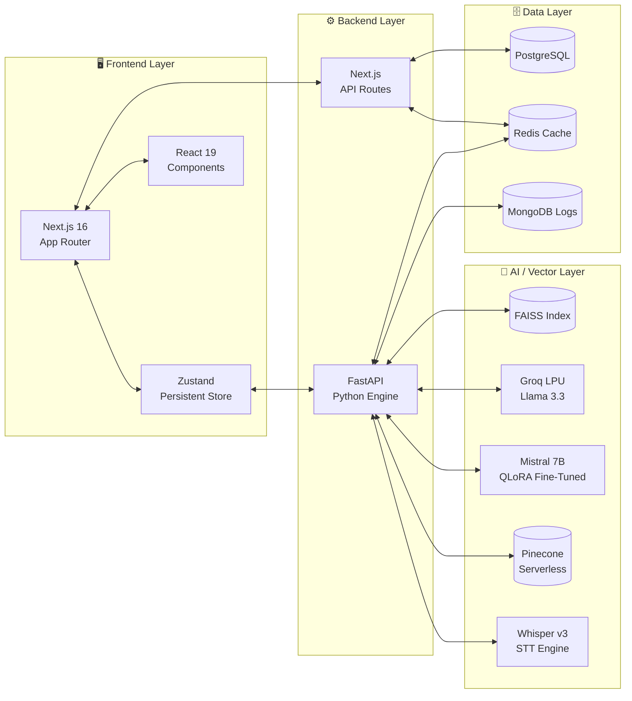

<!-- ═══════════════════════════════════════════════════════════════════ -->
<!--              ANIMATED BANNER HEADER  (local SVG)                  -->
<!-- ═══════════════════════════════════════════════════════════════════ -->
<p align="center">
  
</p>

<!-- ═══════════════════════════════════════════════════════════════════ -->
<!--                   DYNAMIC TYPING  ANIMATION                       -->
<!-- ═══════════════════════════════════════════════════════════════════ -->
<p align="center">
  <a href="https://github.com/yakoob-md">
    
  </a>
</p>

<!-- ═══════════════════════════════════════════════════════════════════ -->
<!--                         CONTACT BADGES                            -->
<!-- ═══════════════════════════════════════════════════════════════════ -->
<p align="center">
  <a href="https://linkedin.com/in/yakoob-md" target="_blank">
    
  </a>&nbsp;&nbsp;
  <a href="mailto:dabaalover@gmail.com" target="_blank">
    
  </a>&nbsp;&nbsp;
  <a href="https://github.com/yakoob-md" target="_blank">
    
  </a>&nbsp;&nbsp;
  <a href="https://intelex.vercel.app/" target="_blank">
    
  </a>
</p>

<br/>

<!-- ═══════════════════════════════════════════════════════════════════ -->
<!--                      NEON DIVIDER                                 -->
<!-- ═══════════════════════════════════════════════════════════════════ -->


<br/>

<!-- ═══════════════════════════════════════════════════════════════════ -->
<!--                       ABOUT ME  ◈  whoami                         -->
<!-- ═══════════════════════════════════════════════════════════════════ -->


### ◈ &nbsp;`whoami`

```typescript
const yakoob = {
  title      : "Full-Stack & Generative AI Systems Engineer",
  experience : "3+ Years of Building",
  location   : "India 🇮🇳",

  philosophy : [
    "If it's slow → it's broken",
    "Latency-first, always",
    "0 compiler errors, non-negotiable"
  ],

  currentlyBuilding : "Vestora — Mutual Fund Portfolio Intelligence Engine",

  projects   : [
    "Vestora · V-Shield AI · InteleX RAG · CUAD Legal AI · Enron NLP"
  ],

  stack : {
    frontend  : ["Next.js 16 (App Router)", "React 19", "Tailwind 4.0", "Framer Motion"],
    backend   : ["FastAPI", "Node.js", "Redis Caching", "Prisma 6 ORM"],
    ai_infra  : ["Pinecone Serverless", "FAISS", "Whisper-v3", "Groq LPU"],
    fine_tune : ["Mistral-7B QLoRA", "Unsloth PEFT", "NF4 Quantization", "Kaggle T4"]
  },

  superpower : "Turning messy real-world data into clean, fast AI systems"
} as const;
```

<br/>

- ⚡ &nbsp;Fine-tuning **Mistral-7B with QLoRA + Unsloth** on a single T4 — memory-efficient to the byte.
- 🗣️ &nbsp;Architecting **Hinglish voice RAG** with Whisper-v3 — 800ms end-to-end for rural athletes.
- 💸 &nbsp;Exposing **hidden mutual fund commission leakage** via real-time NAV divergence analysis.
- 🧠 &nbsp;Obsessed with **deterministic AI outputs** — every answer is grounded, cited, and risk-tagged.

<br/>

<!-- ═══════════════════════════════════════════════════════════════════ -->
<!--                      NEON DIVIDER                                 -->
<!-- ═══════════════════════════════════════════════════════════════════ -->


<br/>

<!-- ═══════════════════════════════════════════════════════════════════ -->
<!--                  TECH STACK  —  ICON GRID                        -->
<!-- ═══════════════════════════════════════════════════════════════════ -->

<h2>🚀 &nbsp;Tech Arsenal</h2>

**Frontend & UI**

<p>
  &nbsp;&nbsp;
  &nbsp;&nbsp;
  &nbsp;&nbsp;
  &nbsp;&nbsp;
  
</p>

**Backend & Databases**

<p>
  &nbsp;&nbsp;
  &nbsp;&nbsp;
  &nbsp;&nbsp;
  &nbsp;&nbsp;
  &nbsp;&nbsp;
  
</p>

**AI / ML / LLM**

<p>
  &nbsp;&nbsp;
  &nbsp;&nbsp;
  &nbsp;&nbsp;
  &nbsp;&nbsp;
  
</p>

<br/>

<!-- ═══════════════════════════════════════════════════════════════════ -->
<!--                    NEON DIVIDER                                   -->
<!-- ═══════════════════════════════════════════════════════════════════ -->


<br/>

<!-- ═══════════════════════════════════════════════════════════════════ -->
<!--                   PROJECT UNIVERSE  SHOWCASE                      -->
<!-- ═══════════════════════════════════════════════════════════════════ -->

<h2>🌌 &nbsp;The Project Universe</h2>

<table width="100%">
  <tr>
    <!-- Vestora — full width flagship -->
    <td colspan="2" valign="top">
      <h3>💸 &nbsp;<a href="https://github.com/yakoob-md/Vestora">Vestora — Mutual Fund Portfolio Co-Pilot</a></h3>
      <p>
        <b>India's first retail wealth leak analyzer.</b> Exposes hidden regular-plan commission leakage in real time using live NAV data from MFAPI, calculates true alpha vs. direct plans, and surfaces rebalancing opportunities with a full fintech-grade dashboard.
      </p>
      <p>
        
        
        
        
        
        
        
      </p>
    </td>
  </tr>
  <tr>
    <!-- V-Shield AI -->
    <td width="50%" valign="top">
      <h3>🛡️ &nbsp;<a href="https://github.com/yakoob-md/v-shield-ai">V-Shield AI</a></h3>
      <p>
        <b>Voice-first anti-doping guardian</b> for Indian rural athletes. Answers Hinglish queries about WADA prohibited substances in under 800ms with deterministic risk-tagging (SAFE ✅ / CAUTION ⚠️ / BANNED ❌).
      </p>
      <p>
        
        
        
        
        
      </p>
    </td>
    <!-- InteleX RAG -->
    <td width="50%" valign="top">
      <h3>🧠 &nbsp;<a href="https://github.com/yakoob-md/InteleX">InteleX RAG</a></h3>
      <p>
        <b>Multi-source semantic ingestion engine</b> consuming PDFs, live websites, and YouTube transcripts into a unified, sub-second knowledge interface. Deployed on Vercel + Hugging Face Spaces.
      </p>
      <p>
        
        
        
        
        
      </p>
    </td>
  </tr>
  <tr>
    <!-- CUAD Legal AI -->
    <td width="50%" valign="top">
      <h3>📜 &nbsp;<a href="https://github.com/yakoob-md/Cuad_finetuned">CUAD Legal AI</a></h3>
      <p>
        <b>Contract clause risk analyzer</b> fine-tuning Mistral-7B with QLoRA PEFT on the CUAD dataset. Benchmarked zero-shot → prompt-engineered → fine-tuned across ROUGE/F1/EM metrics.
      </p>
      <p>
        
        
        
        
        
      </p>
    </td>
    <!-- Enron NLP -->
    <td width="50%" valign="top">
      <h3>🕵️ &nbsp;<a href="https://github.com/yakoob-md/Enron-Disclosure-NLP">Enron Disclosure NLP</a></h3>
      <p>
        <b>Corporate fraud detector</b> running a 2-stage NLP pipeline over the Enron email corpus. BERT + XGBoost ensemble achieves 0.89 F1 on disclosure classification with dynamic threshold tuning.
      </p>
      <p>
        
        
        
        
        
      </p>
    </td>
  </tr>
</table>

<br/>

<!-- ═══════════════════════════════════════════════════════════════════ -->
<!--              ARCHITECTURE  PIPELINE  (collapsible)                -->
<!-- ═══════════════════════════════════════════════════════════════════ -->

<details>
<summary><b>🛠️ &nbsp;Click to expand — Systems & AI Inference Architecture</b></summary>
<br/>



</details>

<br/>

<!-- ═══════════════════════════════════════════════════════════════════ -->
<!--                    NEON DIVIDER                                   -->
<!-- ═══════════════════════════════════════════════════════════════════ -->


<br/>

<!-- ═══════════════════════════════════════════════════════════════════ -->
<!--                    GITHUB  STATS  CARDS                           -->
<!-- ═══════════════════════════════════════════════════════════════════ -->

<h3>📊 &nbsp;GitHub Analytics</h3>

<p align="center">
  <a href="https://github.com/yakoob-md">
    
  </a>
  <a href="https://github.com/yakoob-md">
    
  </a>
</p>

<p align="center">
  
</p>

<br/>

<!-- ═══════════════════════════════════════════════════════════════════ -->
<!--                    NEON DIVIDER                                   -->
<!-- ═══════════════════════════════════════════════════════════════════ -->


<br/>

<!-- ═══════════════════════════════════════════════════════════════════ -->
<!--                   ACTIVITY  GRAPH                                 -->
<!-- ═══════════════════════════════════════════════════════════════════ -->

<h3>📈 &nbsp;Contribution Activity</h3>

<p align="center">
  
</p>

<br/>

<!-- ═══════════════════════════════════════════════════════════════════ -->
<!--                   SNAKE  CONTRIBUTION GRAPH                       -->
<!-- ═══════════════════════════════════════════════════════════════════ -->

<h3>🐍 &nbsp;Commit Journey — Watch the Snake Eat My Contributions</h3>

<p align="center">
  <picture>
    <source media="(prefers-color-scheme: dark)" srcset="https://github.com/yakoob-md/yakoob-md/blob/output/github-contribution-grid-snake-dark.svg?raw=true"/>
    <source media="(prefers-color-scheme: light)" srcset="https://github.com/yakoob-md/yakoob-md/blob/output/github-contribution-grid-snake.svg?raw=true"/>
    
  </picture>
</p>

<br/>

<!-- ═══════════════════════════════════════════════════════════════════ -->
<!--                    NEON DIVIDER                                   -->
<!-- ═══════════════════════════════════════════════════════════════════ -->


<br/>

<!-- ═══════════════════════════════════════════════════════════════════ -->
<!--                  CURRENT  FOCUS  CARD                            -->
<!-- ═══════════════════════════════════════════════════════════════════ -->

<h3>🎯 &nbsp;What I'm Focused On Right Now</h3>

```text
💸  Vestora         ████████████████░░░░  80% — Live NAV divergence + rebalancing engine
🧠  LLM Fine-Tuning ████████████░░░░░░░░  60% — QLoRA PEFT on custom financial corpora
🔊  Voice AI        ██████████░░░░░░░░░░  50% — Whisper-v3 Hinglish pipeline enhancements
🌐  RAG Systems     ████████████████████ 100% — InteleX deployed & live on Vercel
```

<br/>

<!-- ═══════════════════════════════════════════════════════════════════ -->
<!--                    ANIMATED  FOOTER  SVG                          -->
<!-- ═══════════════════════════════════════════════════════════════════ -->
<p align="center">
  
</p>
