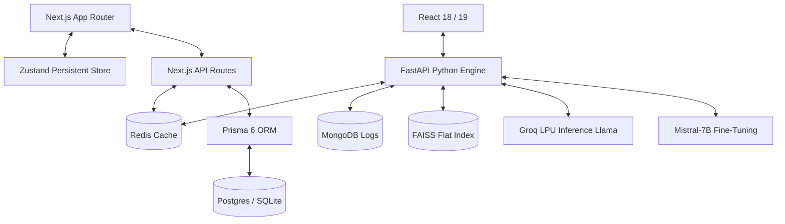

<!-- HEADER RENDERING -->

  

<!-- DYNAMIC TYPING COMPONENT -->

  

<!-- TEXTLESS MINIMAL CONTACT ICON BADGES -->

  &nbsp;&nbsp;
  &nbsp;&nbsp;
  

---

<!-- SIDE-BY-SIDE INTERACTIVE LAYOUT (YAML CODE BLOCK + GIF) -->
<table width="100%">
  <tr>
    <td width="55%" valign="top">
      <h3>👨‍💻 &nbsp;About Me</h3>
      <pre lang="yaml"><code>
about:
  name: Yakoob M.D.
  role: Full-Stack & Generative AI Systems Engineer
  philosophy: "If it's slow, it's broken. Sub-second latency or nothing."
  current_focus:
    - Scaling Vestora Mutual Fund Co-Pilot
    - Voice-first multilingual RAG assistants
  passions:
    - Deep PEFT Quantization (Unsloth, QLoRA)
    - Visual Midnight-Glass UI design & Framer Motion
      </code></pre>
    </td>
    <td width="45%" align="center" valign="middle">
      
    </td>
  </tr>
</table>

---

<!-- MODERN TOOL GRIDS USING DEVICONS -->
<h2>🚀 &nbsp;Some Tools I Have Used and Learned</h2>

  &nbsp;&nbsp;
  &nbsp;&nbsp;
  &nbsp;&nbsp;
  &nbsp;&nbsp;
  &nbsp;&nbsp;
  &nbsp;&nbsp;
  &nbsp;&nbsp;
  &nbsp;&nbsp;
  &nbsp;&nbsp;
  &nbsp;&nbsp;
  &nbsp;&nbsp;
  

---

<!-- THE PROJECT UNIVERSE -->
<h2>🌌 &nbsp;The Project Universe</h2>

<table width="100%">
  <tr>
    <td width="50%" valign="top">
      <h3>🛡️ <a href="https://github.com/yakoob-md/v-shield-ai">V-Shield AI</a></h3>
      
<b>Voice-first vernacular RAG assistant</b> protecting Indian rural athletes from accidental doping using verified WADA data.

      
<code>FastAPI</code> • <code>React</code> • <code>Whisper-v3</code> • <code>FAISS</code> • <code>Llama-3.3</code> • <code>Groq LPU</code>

    </td>
    <td width="50%" valign="top">
      <h3>📜 <a href="https://github.com/yakoob-md/Cuad_finetuned">CUAD Legal AI</a></h3>
      
<b>Contract Clause Analyzer</b> fine-tuning Mistral-7B using QLoRA PEFT coupled with semantic contract vector indexing.

      
<code>Mistral-7B</code> • <code>QLoRA</code> • <code>Unsloth</code> • <code>FastAPI</code> • <code>React</code> • <code>MongoDB</code>

    </td>
  </tr>
  <tr>
    <td width="50%" valign="top">
      <h3>🎙️ <a href="https://github.com/yakoob-md/genAi_finetuned">Meeting Transcript Pipeline</a></h3>
      
<b>NLP fine-tuning pipeline</b> translating noisy dialogues into business intelligence summaries with overfitting safeguards.

      
<code>Mistral-7B</code> • <code>Quantization (NF4)</code> • <code>PyTorch</code> • <code>Kaggle T4</code>

    </td>
    <td width="50%" valign="top">
      <h3>🧠 <a href="https://github.com/yakoob-md/InteleX">InteleX RAG</a></h3>
      
<b>Multi-source semantic ingestion engine</b> parsing PDFs, live websites, and YouTube streams with sub-second inference.

      
<code>FastAPI</code> • <code>Pinecone Serverless</code> • <code>Groq LLaMA</code> • <code>MySQL</code> • <code>Docker</code>

    </td>
  </tr>
  <tr>
    <td width="100%" colspan="2" valign="top">
      <h3>💸 <a href="https://github.com/yakoob-md/Vestora">Vestora: Mutual Fund Portfolio Co-Pilot</a></h3>
      
<b>Retail wealth portfolio leak analyzer</b> exposing regular plan commissions leakage and rebalancing weightings in real time.

      
<code>Next.js 16</code> • <code>React 19</code> • <code>Tailwind 4.0</code> • <code>Prisma 6</code> • <code>Zustand</code> • <code>Redis</code> • <code>PostgreSQL</code>

    </td>
  </tr>
</table>

---

<!-- MERMAID ARCHITECTURAL GRID -->

<b>🛠️ Click to view Systems & Inference Pipeline Alignment</b>

 

---

<!-- DYNAMIC REAL-TIME ANALYTICS CARDS -->
<h3>📈 &nbsp;Real-Time GitHub Analytics</h3>

  &nbsp;
  

---

<!-- CONTRIBUTIONS SNAKE ANIMATION GAME -->
<h3>🐍 &nbsp;Contribution Journey</h3>

  

---

<!-- WAving GRADIENT FOOTER -->

  

